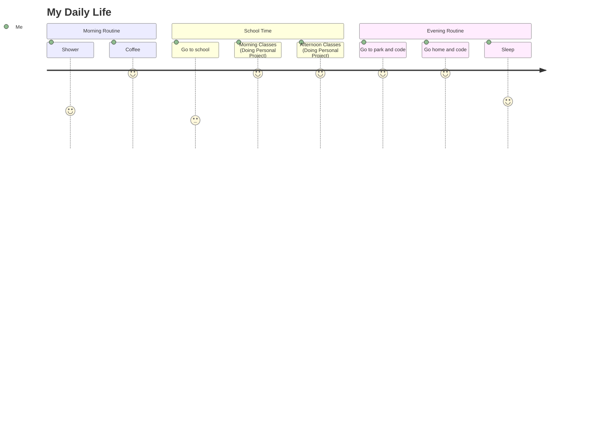

```txt
⣿⣿⣷⡁⢆⠈⠕⢕⢂⢕⢂⢕⢂⢔⢂⢕⢄⠂⣂⠂⠆⢂⢕⢂⢕⢂⢕⢂⢕⢂ 0xbit@github
⣿⣿⣿⡷⠊⡢⡹⣦⡑⢂⢕⢂⢕⢂⢕⢂⠕⠔⠌⠝⠛⠶⠶⢶⣦⣄⢂⢕⢂⢕ -------------------------
⣿⣿⠏⣠⣾⣦⡐⢌⢿⣷⣦⣅⡑⠕⠡⠐⢿⠿⣛⠟⠛⠛⠛⠛⠡⢷⡈⢂⢕⢂ OS: Linux Mint 20.3 x86_64
⠟⣡⣾⣿⣿⣿⣿⣦⣑⠝⢿⣿⣿⣿⣿⣿⡵⢁⣤⣶⣶⣿⢿⢿⢿⡟⢻⣤⢑⢂ Shell: zsh 5.9
⣾⣿⣿⡿⢟⣛⣻⣿⣿⣿⣦⣬⣙⣻⣿⣿⣷⣿⣿⢟⢝⢕⢕⢕⢕⢽⣿⣿⣷⣔ Pronouns: He/Him
⣿⣿⠵⠚⠉⢀⣀⣀⣈⣿⣿⣿⣿⣿⣿⣿⣿⣿⣗⢕⢕⢕⢕⢕⢕⣽⣿⣿⣿⣿ Location: PH, Laguna
⢷⣂⣠⣴⣾⡿⡿⡻⡻⣿⣿⣴⣿⣿⣿⣿⣿⣿⣷⣵⣵⣵⣷⣿⣿⣿⣿⣿⣿⡿ Languages: C/C++, Python, Asm x86-64, Javascript, Html/css, Bash/Powershell
⢌⠻⣿⡿⡫⡪⡪⡪⡪⣺⣿⣿⣿⣿⣿⠿⠿⢿⣿⣿⣿⣿⣿⣿⣿⣿⣿⣿⣿⠃ Learning: Malware devmnt, Exploit devmnt, Code Obfuscation, Hardware Prototyping
⠣⡁⠹⡪⡪⡪⡪⣪⣾⣿⣿⣿⣿⠋⠐⢉⢍⢄⢌⠻⣿⣿⣿⣿⣿⣿⣿⣿⠏⠈ Hobbies: Coding, Reading
⡣⡘⢄⠙⣾⣾⣾⣿⣿⣿⣿⣿⣿⡀⢐⢕⢕⢕⢕⢕⡘⣿⣿⣿⣿⣿⣿⠏⠠⠈ Commits: 5k
⠌⢊⢂⢣⠹⣿⣿⣿⣿⣿⣿⣿⣿⣧⢐⢕⢕⢕⢕⢕⢅⣿⣿⣿⣿⡿⢋⢜⠠⠈ Stars: 500
⠄⠁⠕⢝⡢⠈⠻⣿⣿⣿⣿⣿⣿⣿⣷⣕⣑⣑⣑⣵⣿⣿⣿⡿⢋⢔⢕⣿⠠⠈ Discord: 0xbitx
⠨⡂⡀⢑⢕⡅⠂⠄⠉⠛⠻⠿⢿⣿⣿⣿⣿⣿⣿⣿⣿⡿⢋⢔⢕⢕⣿⣿⠠⠈ Twitter: 0xbit
⠄⠪⣂⠁⢕⠆⠄⠂⠄⠁⡀⠂⡀⠄⢈⠉⢍⢛⢛⢛⢋⢔⢕⢕⢕⣽⣿⣿⠠⠈ 
```
 &emsp; 


